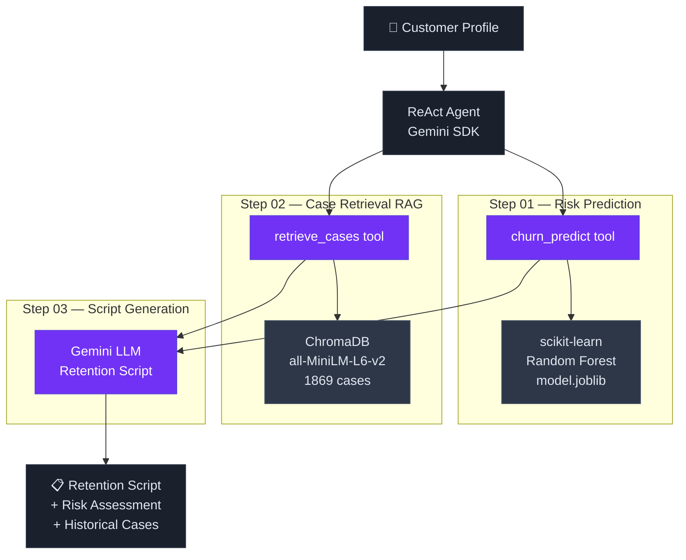

# Churn Retention Agent

> Extends a production MLOps churn prediction pipeline into a full **AI Agent application** — combining ML inference, RAG-powered case retrieval, and LLM-generated retention scripts in a real-time reasoning loop.

[](https://github.com/Mihaivich/churn-retention-agent/actions/workflows/ci_cd.yml)
[](https://huggingface.co/spaces/ikunikunikun/churn-retention-agent)
[](https://www.python.org/)
[](LICENSE)

---

## Live Demo

[](https://huggingface.co/spaces/ikunikunikun/churn-retention-agent)

Use the **Preset** buttons (High / Medium / Low risk) for an instant demo — no manual data entry required.

---

## From MLOps Pipeline to AI Agent

This project is a direct evolution of a production MLOps system ([mlops-churn-project](https://github.com/Mihaivich/mlops-churn-project)). The original pipeline trained and deployed a churn prediction model to AWS SageMaker. This project takes that model and wraps it inside an AI Agent that can **reason, retrieve context, and generate actionable recommendations**.

| Capability | Original MLOps Pipeline | This Project |
|---|---|---|
| **Prediction** | Probability score only | Score + risk level + key factors |
| **Context** | None | RAG retrieves 3 similar historical cases |
| **Output** | Float | Structured retention script with talking points |
| **Reasoning** | Single inference call | 3-step ReAct loop (visible in UI) |
| **Infrastructure** | AWS SageMaker | Local model + in-process fallback |
| **Monitoring** | CloudWatch metrics | Live reasoning trace in dashboard |

---

## How It Works

A customer service agent enters a customer profile. The system runs a **3-step ReAct reasoning loop**, streamed live in the dashboard:



---

## Dataset

The knowledge base and ML model are both built from the **IBM Telco Customer Churn** dataset.

- **Source**: [Kaggle — Telco Customer Churn](https://www.kaggle.com/datasets/blastchar/telco-customer-churn)
- **Size**: 7,043 customer records, 21 features
- **Target**: `Churn` (Yes / No)
- **Key features**: `tenure`, `Contract`, `InternetService`, `MonthlyCharges`, `PaymentMethod`
- **Privacy**: Fully anonymized, no PII

The 1,869 churned customers are converted into natural-language documents and indexed in ChromaDB, forming the RAG knowledge base used by `retrieve_cases`.

---

## Model Performance

Trained with scikit-learn on an 80/20 train/test split with hyperparameter tuning.

| Metric | Score |
|:---|:---|
| **ROC AUC** | **0.832** |
| Accuracy | 0.791 |
| Precision | 0.629 |
| Recall | 0.521 |
| F1 Score | 0.570 |

---

## Tech Stack

| Layer | Technology |
|---|---|
| **ML Model** | scikit-learn Random Forest (joblib) |
| **Model Serving** | FastAPI (local dev) / `@st.cache_resource` in-process fallback (production) |
| **Vector Store** | ChromaDB + `sentence-transformers/all-MiniLM-L6-v2` |
| **Agent / LLM** | Google Gemini via `google-genai` SDK |
| **Frontend** | Streamlit — dark theme, zh/en bilingual, live trace |
| **Data Pipeline** | DVC (4 stages: ingest → validate → train → evaluate) |
| **CI/CD** | GitHub Actions → Hugging Face Spaces (Docker) |

---

## Project Structure

```
churn-retention-agent/
│
├── app.py                          # Streamlit dashboard (main entry point)
├── local_model_server.py           # FastAPI server (local dev only)
│
├── tools/
│   ├── churn_predict.py            # Tool 1: ML inference (dual-backend)
│   ├── retrieve_cases.py           # Tool 2: RAG semantic search
│   └── build_knowledge_base.py     # One-time ChromaDB builder
│
├── agent/
│   └── runner.py                   # ReAct loop (CLI entry point)
│
├── tests/
│   └── test_churn_predict.py       # 14 unit tests — no AWS needed
│
├── src/                            # DVC pipeline stages
│   ├── data_ingest.py
│   ├── data_validation.py
│   ├── train_and_tune.py
│   └── evaluate.py
│
├── model/
│   └── model.joblib                # Trained model (124KB, tracked in git)
│
├── chroma_db/                      # Vector store (excluded from git)
├── Dockerfile                      # HF Spaces deployment
├── dvc.yaml                        # Pipeline definition
├── params.yaml                     # Hyperparameters
└── .github/workflows/ci_cd.yml     # CI: pytest + CD: sync to HF Spaces
```

---

## Local Setup

### Prerequisites

- Python 3.11
- Gemini API key

### Installation

```bash
git clone https://github.com/Mihaivich/churn-retention-agent.git
cd churn-retention-agent

python3 -m venv venv && source venv/bin/activate
pip install -r requirements.txt
```

### Build the RAG Knowledge Base

The `chroma_db/` vector store is not included in git. Build it once locally (requires the dataset):

```bash
# The dataset is excluded from git — download it from Kaggle first:
# https://www.kaggle.com/datasets/blastchar/telco-customer-churn
# Place it at: data/raw/WA_Fn-UseC_-Telco-Customer-Churn.csv

# Then build the knowledge base (~2 min, downloads MiniLM model on first run)
python tools/build_knowledge_base.py
```

### Configure API Key

```bash
cp .env.example .env
# Edit .env and set: GEMINI_API_KEY=your_key_here
```

### Run

```bash
# Optional: start FastAPI model server for green status badge
python local_model_server.py

# Launch dashboard
export GEMINI_API_KEY="your_key"
streamlit run app.py
# → http://localhost:8501
```

### Retrain Model from Scratch

```bash
dvc repro
```

Runs all 4 pipeline stages: `data_ingest → data_validation → train_and_tune → evaluate`

---

## CLI Agent (without UI)

Run the ReAct agent directly from the terminal:

```bash
export GEMINI_API_KEY="your_key"
python agent/runner.py
```

This prints the full reasoning trace — tool calls, observations, and the final retention recommendation — to stdout.

---

## Tests

All tests use mocked dependencies — no AWS credentials, no live API calls needed.

```bash
pytest tests/ -v
```

```
tests/test_churn_predict.py::TestChurnPredictTool::test_high_risk_customer    PASSED
tests/test_churn_predict.py::TestChurnPredictTool::test_low_risk_customer     PASSED
tests/test_churn_predict.py::TestChurnPredictTool::test_medium_risk_customer  PASSED
...
14 passed in 0.11s
```

---

## CI/CD Pipeline

Every push to `main` triggers two sequential jobs:

```
push to main
     │
     ▼
┌──────────┐   pass   ┌────────────────────────┐
│  pytest  │ ───────► │   Sync to HF Spaces    │
│  14 tests│          │   (code files only,    │
└──────────┘          │   model stays in git)  │
     │ fail           └────────────────────────┘
     ▼
  deploy blocked
```

Pull requests only run tests. Deployment is gated to `main` merges only.

Secrets required in GitHub repository settings:

| Secret | Purpose |
|---|---|
| `HF_TOKEN` | Hugging Face write access for Space sync |

---

## Deployment

The app is deployed to Hugging Face Spaces as a Docker container.

**Live**: [huggingface.co/spaces/ikunikunikun/churn-retention-agent](https://huggingface.co/spaces/ikunikunikun/churn-retention-agent)

Use the **Preset** buttons (High / Medium / Low risk) for a quick demo without manual data entry.

To redeploy manually:

```bash
# First, log in to Hugging Face
hf auth login

python upload_to_hf.py
```

Set `GEMINI_API_KEY` in the Space's **Settings → Variables and secrets** for full LLM functionality. Without it, risk prediction and RAG still work — only the retention script generation is disabled.

---

## Governance

- **Human-in-the-loop**: The dashboard displays full reasoning trace before any recommendation is acted upon — no silent AI decisions
- **Model versioning**: `model.joblib` tracked in git; pipeline reproducible via `dvc repro`
- **Test coverage**: 14 unit tests covering risk classification, tool schema validation, and error handling
- **Deployment gate**: Tests must pass before any code reaches the live Space
